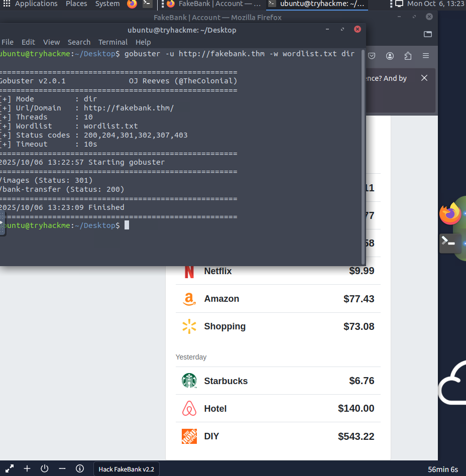
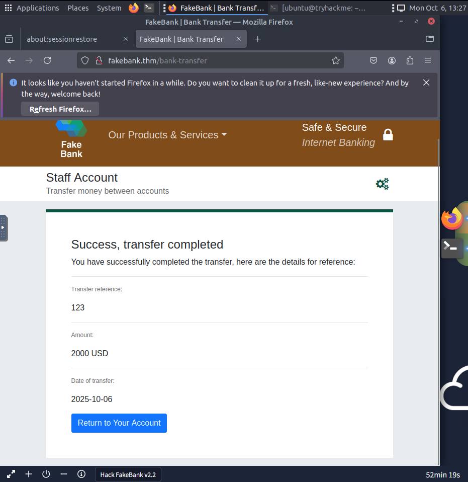

# TryHackMe — Offensive Security Intro

**Date:** 2025-10-06  
**Room:** Offensive Security Intro — https://tryhackme.com/room/offensive-security-intro  
**Completed:** Yes (AttackBox used)

## Short summary
I used `gobuster` to find hidden pages on the FakeBank site. I found `/bank-transfer`, opened that page in the browser, and used the form to transfer $2000 from account `2276` to account `8881`. The lab showed a success message and the updated balance.

## What I did (steps)
1. Ran directory discovery:
   - Command I used: `gobuster dir -u http://fakebank.thm -w wordlist.txt`
   - Result: found `/bank-transfer`.

2. Visited the page:
   - Opened `http://fakebank.thm/bank-transfer` in the browser.
   - Saw a transfer form with fields: `from`, `to`, `amount`.

3. Submitted the transfer (in browser):
   - Filled the form: `from = 2276`, `to = 8881`, `amount = 2000`.
   - Clicked submit and saw a success/confirmation page with the updated balance.

## Proof (Screenshots)

## Room answer
BANK-HACKED

## What I learned
- Simple directory fuzzing can reveal hidden admin pages.
- Always check forms in the browser (or with devtools) to see how they work.
- Only test in authorized labs (this was on TryHackMe).
